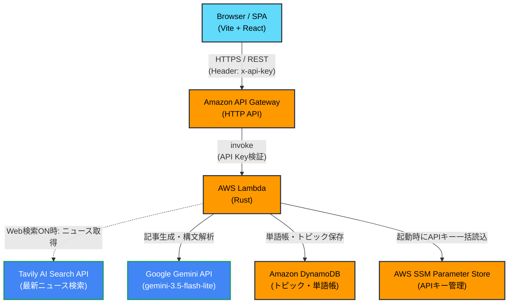
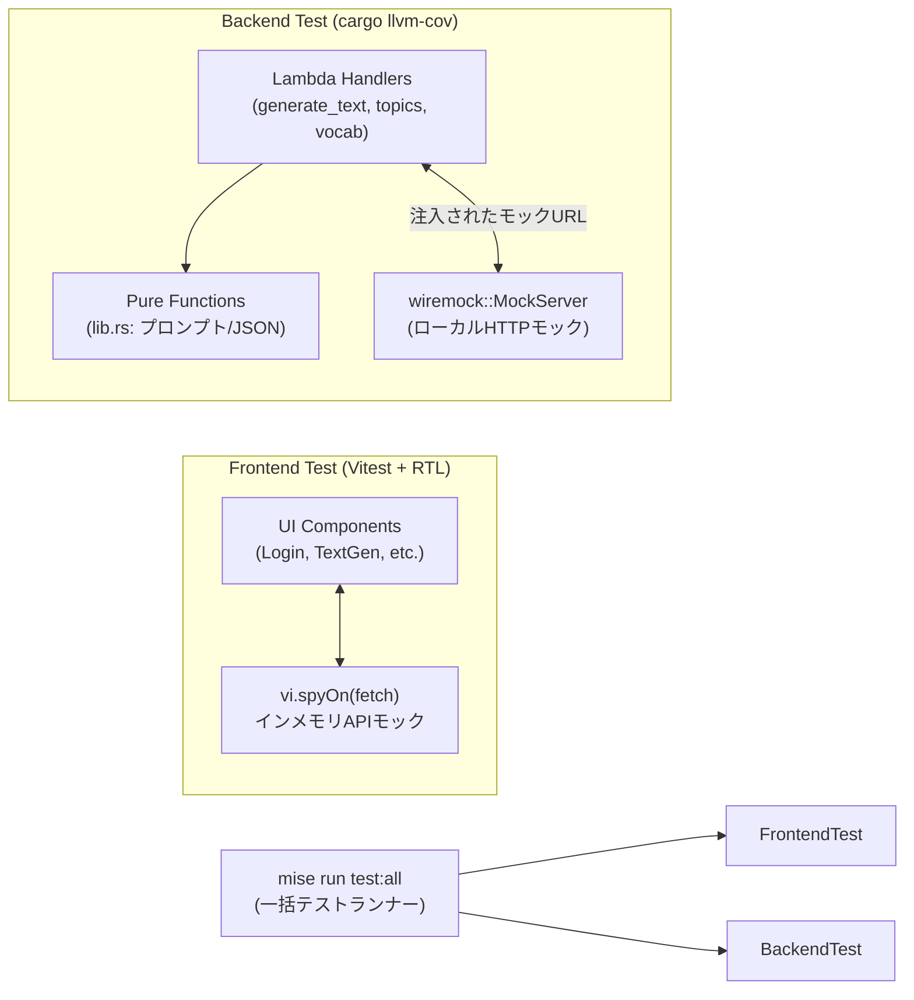

# 全体アーキテクチャ設計書

## 1. システム構成図


## 2. コンポーネント役割

| コンポーネント | 役割 |
|----------------|------|
| フロントエンド (React) | ユーザーUI。トピック選択、Web検索ON/OFF、生成記事の読解・構文解析表示・単語保存を行う。 |
| API Gateway | エンドポイントの提供、CORS制御、スロットリングによるレートリミット。 |
| Lambda (Rust) | メインロジック。起動時(`main`)にSSMからAPIキーをキャッシュし、Tavily/Gemini呼び出しやDB操作を超高速に処理。 |
| DynamoDB | シングルテーブル設計を用いたデータの永続化（トピック・単語帳）。 |
| Tavily AI Search API | 最新ニュース検索エンジン。トピックに関連する直近3日間のニュース記事とURLを取得。 |
| Gemini API | LLMエンジン (`gemini-3.5-flash-lite`)。英文記事生成および構文・単語解析を担当。 |
| SSM Parameter Store | `x-api-key`、`GEMINI_API_KEY`、`TAVILY_API_KEY` の安全な保持・管理。 |

## 3. ディレクトリ・モジュール構成方針

```
ai-english-learner/          # プロジェクトルート
├── .mise/tasks/             # タスクランナー定義
│   ├── dev/                 # ローカル開発用 (back, front)
│   ├── deploy/              # 本番デプロイ用 (infra, front, all)
│   ├── test/                # 自動テスト用 (back, front, all)
│   └── setup                # 初期環境構築スクリプト
├── backend/                 # サーバー側リポジトリ (Rust)
│   ├── infra/               # Terraformコード (AWSリソース定義)
│   └── src/                 # Rustコード (lib.rs: 共通純粋関数, bin/: 各Lambda関数)
├── docs/                    # ドキュメントディレクトリ
│   ├── architecture.md      # 本ドキュメント
│   ├── design.md            # 基本設計書
│   ├── requirements.md      # 要件定義
│   ├── CONTRIBUTING.md      # 開発手順書
│   └── learning/            # 学習・設計判断の記録 (ADR等)
├── frontend/                # クライアント側リポジトリ (Vite + React 19)
│   └── src/                 # Reactソースコード (components/, test/)
└── README.md                # プロジェクト概要
```

---

## 4. テストアーキテクチャ（モック分離）

本システムは、CI環境や手元開発で外部APIトークンを1ミリも消費せず、高速・安定して実行可能なモック分離アーキテクチャを採用しています。



- **フロントエンド**: `Vitest` 上でブラウザの `fetch` を直接モック化。API Gateway やバックエンドを起動せずにコンポーネントの状態遷移を数秒で検証。
- **バックエンド**: `wiremock` によりローカルで HTTP モックサーバーを立ち上げ、`ApiEndpoints` を注入することで Tavily や Gemini との通信を完全シミュレート。

