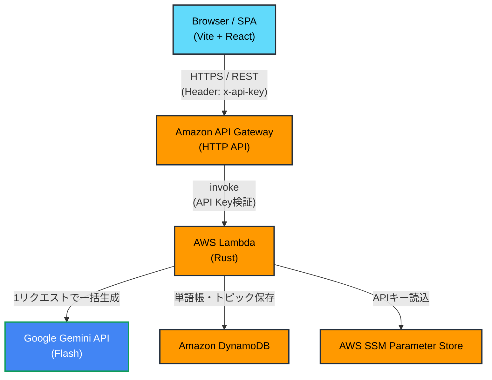

# 全体アーキテクチャ設計書

## 1. システム構成図


## 2. コンポーネント役割

| コンポーネント | 役割 |
|----------------|------|
| フロントエンド (React) | ユーザーUI。APIへリクエストし、取得したJSONデータからインタラクティブな読解画面を構成する。 |
| API Gateway | エンドポイントの提供、CORS制御、スロットリングによるレートリミット。 |
| Lambda (Rust) | メインロジック。ルーティングはAPI Gatewayに任せ、機能ごとに1リソース1Lambdaで構成。超高速起動。 |
| DynamoDB | シングルテーブル設計を用いたデータの永続化。 |
| Gemini API | 英文・和訳・構文解説の自動生成AIエンジン。 |
| SSM Parameter Store | `x-api-key` （フロントとバックで共有する簡易認証キー）や `GEMINI_API_KEY` の保持。 |

## 3. ディレクトリ・モジュール構成方針

```
aws-work/
├── eng-app-backend/     # サーバー側リポジトリ
│   ├── docs/            # バックエンド設計書 (API, DBなど)
│   ├── infra/           # Terraformコード
│   └── src/             # Rustコード (binごとに各Lambda関数を定義)
├── eng-app-frontend/    # クライアント側リポジトリ
│   └── src/             # Vite + React のソースコード
├── requirements.md      # 要件定義
├── architecture.md      # 本ドキュメント
└── HANDOFF.md           # 引き継ぎ資料
```
