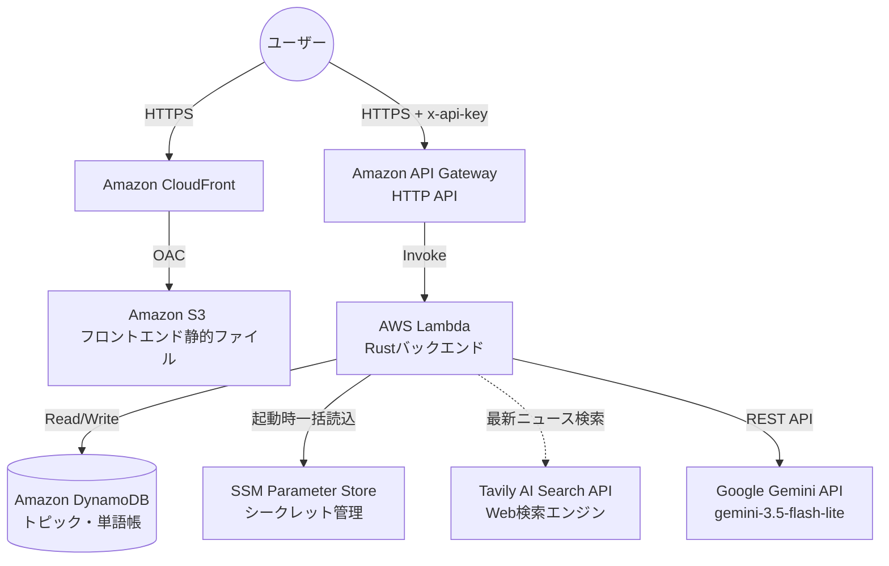
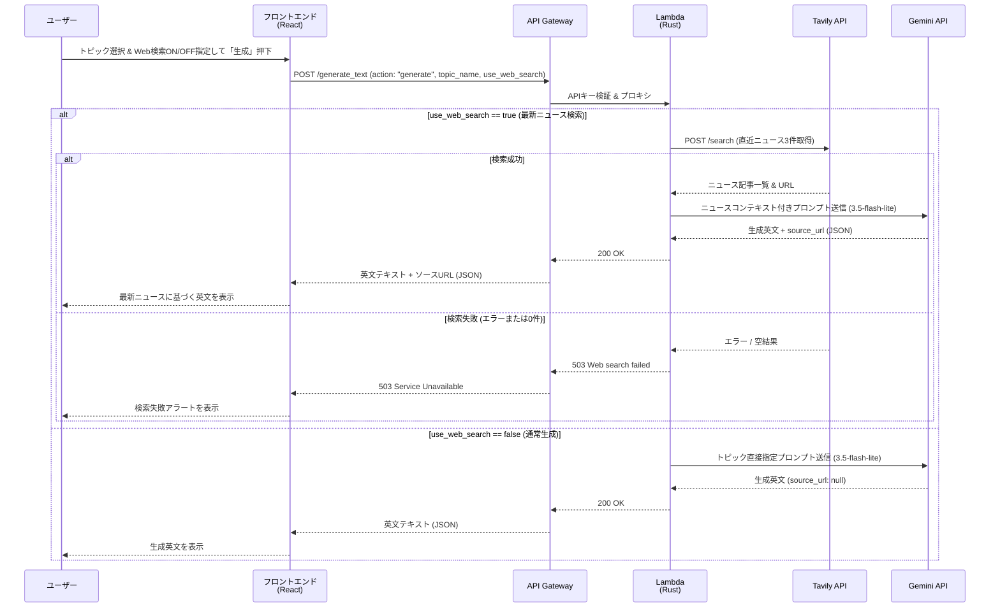
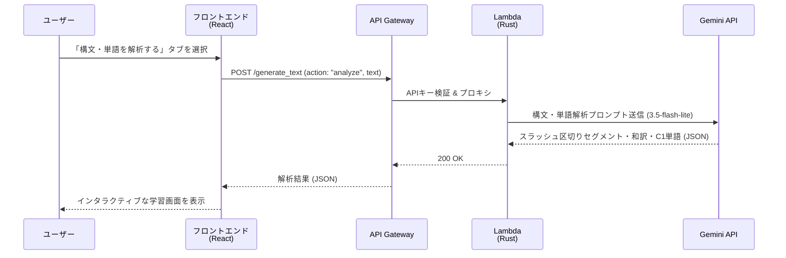
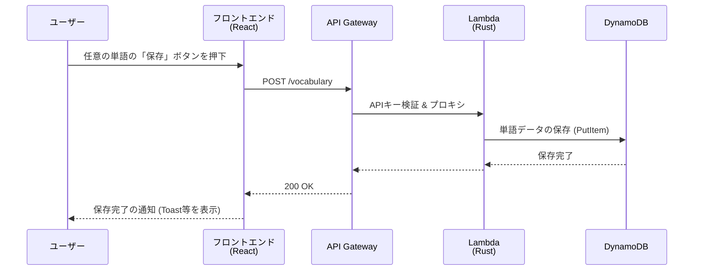
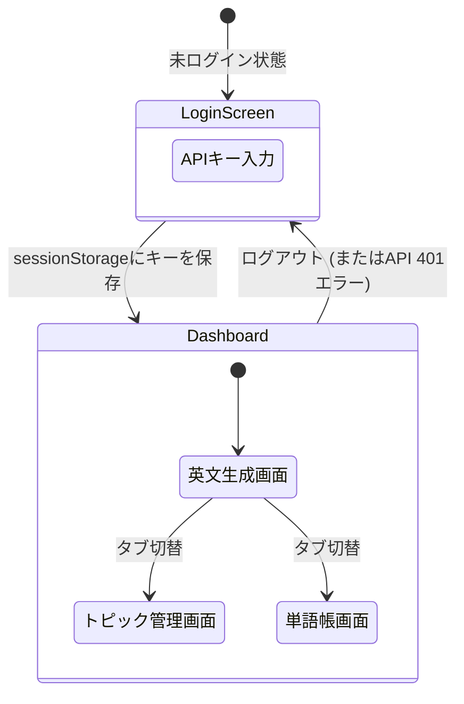

# システム基本設計書

本ドキュメントは、AI英語学習サーバーレスAPI（ENG-APP）のシステム設計情報およびアーキテクチャを定義します。
要求事項については [requirements.md](./requirements.md) を、APIの詳細なエンドポイント仕様については [api/endpoints.md](./api/endpoints.md) を参照してください。

---

## 1. アーキテクチャ概要

本システムはAWSのマネージドサービスを活用したフルサーバーレス構成を採用しています。



---

## 2. システムシーケンス図（データフロー）

AIによる英文生成から構文解析、そして単語帳への保存までの一連の処理フローです。
最新ニュース検索機能（Tavily）と、生成・要約機能（Gemini 3.5 Flash-lite）を明確に責務分離している点が特徴です。

### 英文記事の生成フロー (Web検索ON / OFF)



### 構文解析・単語抽出フロー



### 単語帳への登録フロー

ユーザーが学習画面から重要単語を選んで保存する際のシーケンスです。



---

## 3. フロントエンド画面遷移フロー

フロントエンド（React/SPA）における、ユーザー視点の画面（UI）遷移図です。
初回アクセス時の認証画面から、ホーム画面、各学習画面、単語帳への導線を示しています。



---

## 4. セキュリティ・認証設計

- **認証方式**: 簡易APIキー認証（HTTP Header: `x-api-key`）
- **キー管理**: バックエンド側（SSM Parameter Store / ローカル環境変数）で以下のシークレットを管理。
  - `/eng-app/api-key`: フロントエンドとバックエンドで共有する認証キー
  - `/eng-app/gemini-api-key`: Google Gemini APIキー
  - `/eng-app/tavily-api-key`: Tavily AI Search APIキー
  フロントエンド側では初回アクセス時にユーザーが入力したキーを `sessionStorage` に保存して利用します。これにより、クライアントのソースコードへの直書きを回避します。
- **コールドスタート時のキーキャッシュ**: Lambdaの起動時（`main()`）にSSMから各APIキーを非同期取得してメモリにキャッシュ保持（`Arc<String>`）し、毎リクエストでのSSMフェッチ遅延を解消。
- **検証ロジック**: API Gateway または Lambda の冒頭でヘッダーの `x-api-key` をチェック。不一致の場合は `401 Unauthorized` を返し、後続処理（Tavily/Gemini API呼び出し・DynamoDBアクセス）を遮断します。
- **追加対策**: 
  - CORS設定で許可オリジンを自ドメイン（および開発時はlocalhost）に限定。
  - API Gateway スロットリングを設定し、万一キーが流出しても大量のアクセスおよび課金を防ぎます。
  - Web検索失敗時は曖昧なフォールバックを行わず、`503 Service Unavailable` を返却してユーザーにエラーを明示。

---

## 5. データ設計（DynamoDB）

データは単一のテーブル（シングルテーブル設計）に保存されます。

**テーブル名**: `eng-app-table`

| PK | SK | 用途 |
|----|----|------|
| `VOCAB` | `WORD#<uuid>` | 単語帳エントリ |
| `TOPIC` | `TOPIC#<uuid>` | トピックリスト |

---

## 6. API設計

APIの設計仕様（リクエスト・レスポンス・パス）については、以下の独立したドキュメントで管理しています。

👉 **[Web API エンドポイント仕様一覧 (docs/api/endpoints.md)](./api/endpoints.md)**

---

## 7. テスト設計とモック分離（Testability）

本システムは、CI環境および手元での継続的テストを可能にするため、外部APIへの依存を完全にモック分離したテスタビリティ構造を備えています。

### 7.1 バックエンド・テスト設計 (`backend/src`)
* **依存性注入 (Dependency Injection)**:
  `generate_text` ハンドラは外部APIのエンドポイントURLを保持する `ApiEndpoints` 構造体を受け取ります。本番環境ではデフォルト値（公式URL）を使用し、テスト環境ではローカルの `wiremock::MockServer` のURLを注入します。
* **純粋関数の抽出 (`lib.rs`)**:
  プロンプト生成（`build_generate_prompt`, `build_analyze_prompt`）や、Markdownブロック除去・JSON抽出（`extract_json_payload`）、認証検証（`validate_api_key`）などのロジックを副作用のない純粋関数として切り出し、単体テストを網羅。
* **カバレッジ測定**:
  `cargo-llvm-cov` を用いて、テスト実行と同時にターミナルサマリーおよびHTMLレポート（`backend/target/llvm-cov/html/index.html`）を生成。

### 7.2 フロントエンド・テスト設計 (`frontend/src`)
* **Vitest + React Testing Library**:
  ブラウザ起動のオーバーヘッドを排し、`jsdom` 環境で React 19 コンポーネントの状態変化、非同期ローディング、バリデーションを高速（数秒）に検証。
* **ネットワーク通信の完全モック**:
  `api.ts` の `fetch` 処理はテスト内でモック化され、実際のAPI Gatewayやバックエンドとの通信を行いません。401認証切れ時の自動セッション破棄や、503障害時のエラーメッセージ表示などのエッジケースを自在にシミュレート可能。

### 7.3 テスト実行コマンド (Mise)
```bash
mise run test:all    # バックエンド ＋ フロントエンド一括実行 (計63件 PASS)
mise run test:back   # バックエンド（Rust）のみ
mise run test:front  # フロントエンド（Vitest）のみ
```

