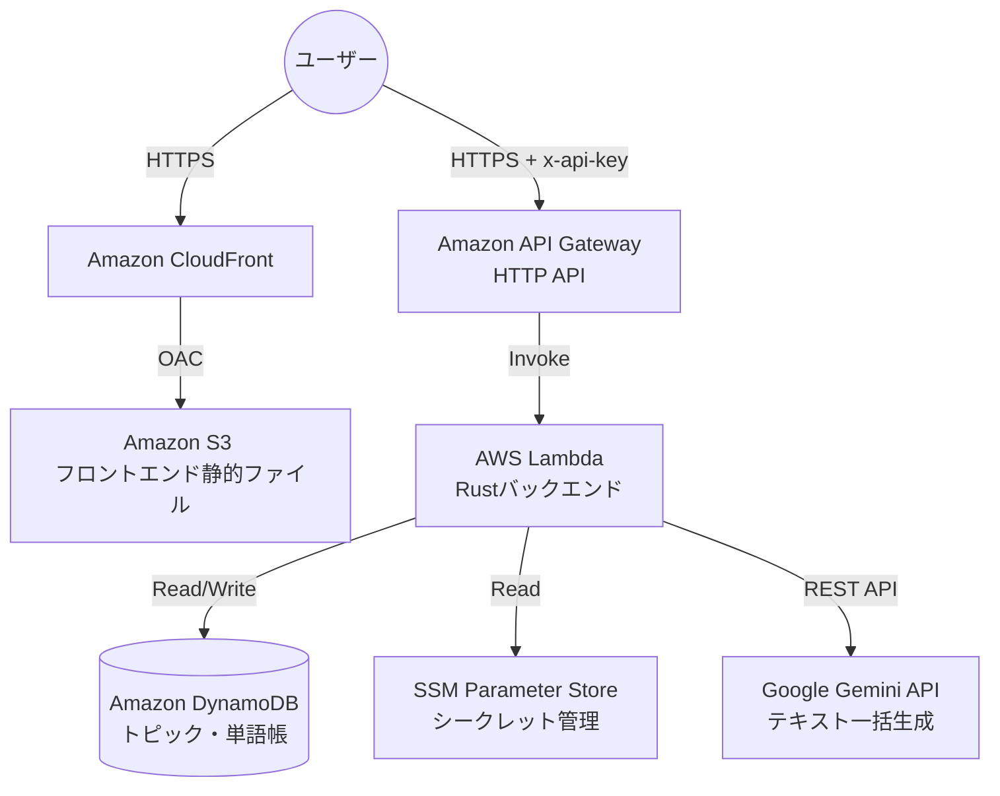
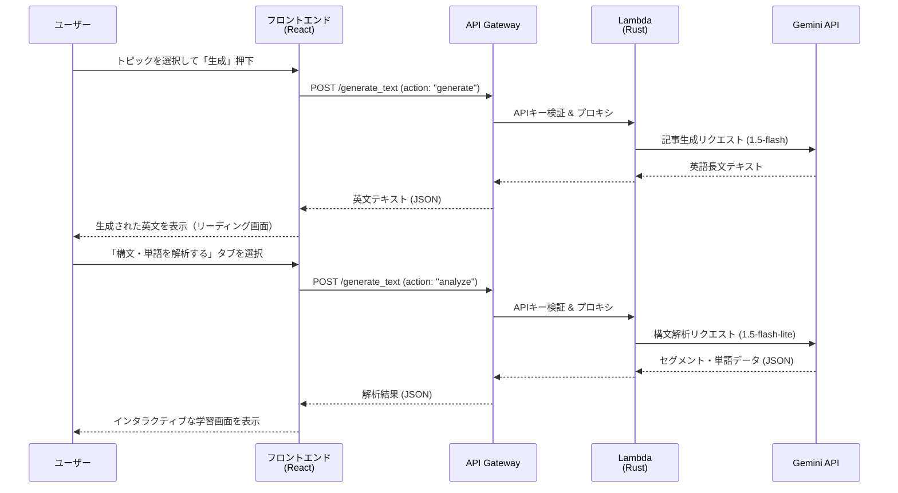
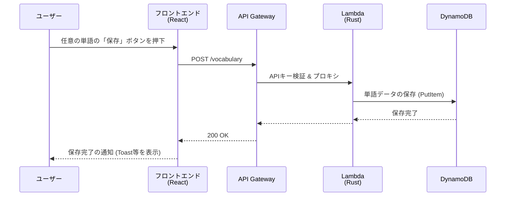
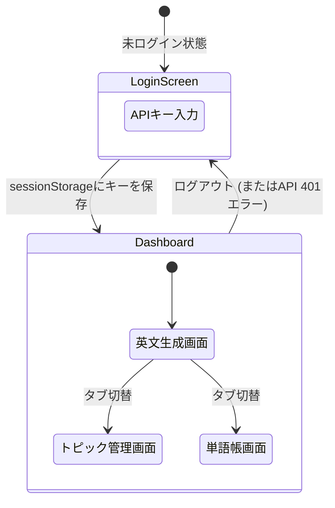

# システム基本設計書

本ドキュメントは、AI英語学習サーバーレスAPI（ENG-APP）のシステム設計情報およびアーキテクチャを定義します。
要求事項については [requirements.md](./requirements.md) を、APIの詳細なエンドポイント仕様については [api/endpoints.md](./api/endpoints.md) を参照してください。

---

## 1. アーキテクチャ概要

本システムはAWSのマネージドサービスを活用したフルサーバーレス構成を採用しています。

---

## 2. システムシーケンス図（データフロー）

AIによる英文生成から構文解析、そして単語帳への保存までの一連の処理フローです。
記事生成と解析で2回に分けてAPIを呼び出し、Geminiモデルを使い分ける（ハイブリッドアーキテクチャ）点が特徴です。

### 単語帳への登録フロー

ユーザーが学習画面から重要単語を選んで保存する際のシーケンスです。

---

## 3. フロントエンド画面遷移フロー

フロントエンド（React/SPA）における、ユーザー視点の画面（UI）遷移図です。
初回アクセス時の認証画面から、ホーム画面、各学習画面、単語帳への導線を示しています。

---

## 4. セキュリティ・認証設計

- **認証方式**: 簡易APIキー認証（HTTP Header: `x-api-key`）
- **キー管理**: バックエンド側（SSM Parameter Store / Lambda環境変数）でシークレットキーを保持し、フロントエンド側では初回アクセス時にユーザーが入力したキーを `sessionStorage` に保存して利用します。これにより、クライアントのソースコードへの直書きを回避します。
- **検証ロジック**: API Gateway または Lambda の冒頭でヘッダーの `x-api-key` をチェック。不一致の場合は `401 Unauthorized` を返し、後続処理（Gemini API呼び出し・DynamoDBアクセス）を遮断します。
- **追加対策**: 
  - CORS設定で許可オリジンを自ドメインに限定。
  - API Gateway スロットリングを設定し、万一キーが流出しても大量のアクセスおよび課金を防ぎます。

---

## 5. データ設計（DynamoDB）

データは単一のテーブル（シングルテーブル設計）に保存されます。

**テーブル名**: `eng-app-table`

| PK | SK | 用途 |
|----|----|------|
| `VOCAB` | `WORD#<uuid>` | 単語帳エントリ |
| `TOPIC` | `TOPIC#<uuid>` | トピックリスト |

---

## 6. API設計

APIの設計仕様（リクエスト・レスポンス・パス）については、以下の独立したドキュメントで管理しています。

👉 **[Web API エンドポイント仕様一覧 (docs/api/endpoints.md)](./api/endpoints.md)**
