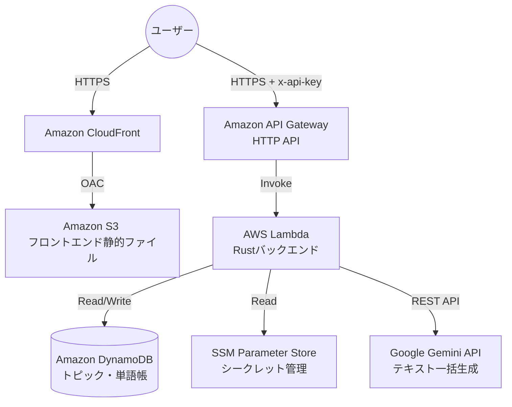

# クラウドネイティブ開発 学習メモ (ENG-APP)

AWS初心者が「AIを活用した英語学習用サーバーレスAPI」をフルスクラッチで構築した際の開発ノウハウまとめ。

## システム概要
- **目的**: 英語の速読訓練・構文読解・重要単語把握をAIで一括支援するアプリ
- **運用形態**: 個人利用向け、フルサーバーレス
- **コスト**: 完全無料枠内（$0/月）での運用を前提とする
- **技術スタック**:
  - フロントエンド: Vite + React (S3 + CloudFrontホスティング)
  - バックエンド: Rust (Lambda) + API Gateway + DynamoDB
  - AIモジュール: Google Gemini API (gemini-1.5-flash)

## 全体構成図 (アーキテクチャ)

## 目次

1. [TerraformとAWSインフラ基盤](./01_terraform_infrastructure.md)
2. [Rustによるサーバーレスバックエンド](./02_rust_backend.md)
3. [モダンフロントエンド開発とセキュリティ](./03_frontend_react.md)
4. [AI (Gemini) 連携のベストプラクティス](./04_ai_integration.md)
5. [サーバーレスのコスト最適化戦略](./05_cost_optimization.md)
6. [サーバーレス＆AIアプリのローカル開発手法](./06_local_dev_strategy.md)
7. [アーキテクチャ・デシジョン・レコード (ADR)](./07_architecture_decisions.md)
