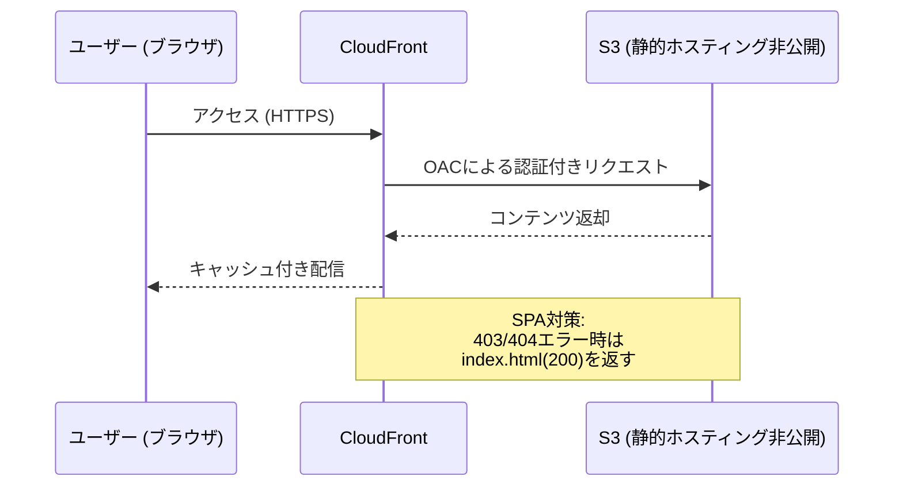

# 2. TerraformとAWSインフラ基盤

AWSリソースをTerraformでコード化（IaC）し、安全かつ自動でデプロイするためのノウハウと実装例。

## トピック1: サーバーレスバックエンドの接続

- **構成**: AWS Lambda + Amazon API Gateway (HTTP API)
- **必須リソース**: Terraformで連携させるには以下の3つが必要。
  1. `aws_apigatewayv2_integration` (連携設定)
  2. `aws_apigatewayv2_route` (ルーティング)
  3. `aws_lambda_permission` (実行権限)
- **注意点**: GUI操作では自動付与される `Permission` も、Terraformでは明示的に記述しないと 500 Internal Server Error になる。

### 実装サンプル

```hcl
# 1. Lambda関数の作成
resource "aws_lambda_function" "my_lambda" {
  function_name = "hello-world-function"
  filename      = "function.zip"
  handler       = "index.handler"
  runtime       = "nodejs20.x"
  role          = aws_iam_role.lambda_exec.arn 
}

# 2. API Gateway (HTTP API) の作成
resource "aws_apigatewayv2_api" "my_api" {
  name          = "hello-world-api"
  protocol_type = "HTTP"

  cors_configuration {
    allow_origins = ["https://my-website.com", "http://localhost:5173"]
    allow_methods = ["GET", "POST", "OPTIONS"]
    allow_headers = ["Content-Type", "x-api-key"]
    max_age       = 300
  }
}

# 3. API Gateway と Lambda を繋ぐ設定 (Integration)
resource "aws_apigatewayv2_integration" "lambda_integration" {
  api_id           = aws_apigatewayv2_api.my_api.id
  integration_type = "AWS_PROXY"
  integration_uri  = aws_lambda_function.my_lambda.invoke_arn
}

# 4. ルーティングの設定 (Route)
resource "aws_apigatewayv2_route" "api_route" {
  api_id    = aws_apigatewayv2_api.my_api.id
  route_key = "GET /hello" 
  target    = "integrations/${aws_apigatewayv2_integration.lambda_integration.id}"
}

# 5. API Gateway に Lambda を実行する許可を与える (Permission)
resource "aws_lambda_permission" "api_gw_permission" {
  statement_id  = "AllowExecutionFromAPIGateway"
  action        = "lambda:InvokeFunction"
  function_name = aws_lambda_function.my_lambda.function_name
  principal     = "apigateway.amazonaws.com"
  source_arn    = "${aws_apigatewayv2_api.my_api.execution_arn}/*/*"
}
```

---

## トピック2: フロントエンドのセキュアな配信 (S3 + CloudFront)

### 配信アーキテクチャ


### 設計のポイント
- **S3の非公開化**: バケットへの直接アクセスを遮断（パブリックアクセス拒否）。
- **OAC (Origin Access Control)**: CloudFrontからS3へ安全にアクセスするためのAWSの最新の認証方式（従来のOAIの代替）。S3側でCloudFrontからの通信のみを許可できるようになる。
- **SPAルーティング対策**: React等のSPAでは、直接URLアクセス時にCloudFrontが403/404エラーとなるため、`index.html` (ステータス200) にフォールバックさせる設定が必須。

### 実装サンプル

```hcl
# 1. S3バケットの作成
resource "aws_s3_bucket" "frontend" {
  bucket = "my-frontend-app-bucket-123"
}

# 2. S3のパブリックアクセスをブロック
resource "aws_s3_bucket_public_access_block" "frontend" {
  bucket                  = aws_s3_bucket.frontend.id
  block_public_acls       = true
  block_public_policy     = true
  ignore_public_acls      = true
  restrict_public_buckets = true
}

# 3. CloudFront用の Origin Access Control (OAC)
resource "aws_cloudfront_origin_access_control" "frontend" {
  name                              = "frontend-oac"
  origin_access_control_origin_type = "s3"
  signing_behavior                  = "always"
  signing_protocol                  = "sigv4"
}

# 4. CloudFront ディストリビューション
resource "aws_cloudfront_distribution" "frontend" {
  origin {
    domain_name              = aws_s3_bucket.frontend.bucket_regional_domain_name
    origin_id                = "S3-frontend"
    origin_access_control_id = aws_cloudfront_origin_access_control.frontend.id
  }

  default_root_object = "index.html"
  
  # SPAのルーティング対策
  custom_error_response {
    error_code         = 403
    response_code      = 200
    response_page_path = "/index.html"
  }
  custom_error_response {
    error_code         = 404
    response_code      = 200
    response_page_path = "/index.html"
  }
}

# 5. S3バケットポリシー (OACからのアクセス許可)
resource "aws_s3_bucket_policy" "frontend_policy" {
  bucket = aws_s3_bucket.frontend.id
  policy = jsonencode({
    Version = "2012-10-17"
    Statement = [
      {
        Sid       = "AllowCloudFrontServicePrincipal"
        Effect    = "Allow"
        Principal = { Service = "cloudfront.amazonaws.com" }
        Action   = "s3:GetObject"
        Resource = "${aws_s3_bucket.frontend.arn}/*"
        Condition = {
          StringEquals = { "AWS:SourceArn" = aws_cloudfront_distribution.frontend.arn }
        }
      }
    ]
  })
}
```

---

## トピック3: カスタムランタイム(Rust)のデプロイ

Rustバイナリを動かすため、OSのみを提供するカスタムランタイム (`provided.al2023`) を使用してデプロイします。

### 実装サンプル

```hcl
resource "aws_lambda_function" "api_lambda" {
  function_name = "my-rust-lambda"
  # cargo lambda等でコンパイル・圧縮したZIPファイルを指定
  filename      = "function.zip"
  # カスタムランタイムの場合は handler の値は任意だが、通常は bootstrap などを指定
  handler       = "bootstrap"
  # OSのみを提供するカスタムランタイムを指定
  runtime       = "provided.al2023"
  role          = aws_iam_role.lambda_role.arn
}
```

---

## トピック4: DynamoDBのシングルテーブル設計

RDBのようにテーブルを分割せず、1つのテーブル（`eng-app-table`）で複数種類のデータ（トピック、単語など）を扱うための設計例です。

### 実装サンプル

```hcl
resource "aws_dynamodb_table" "main" {
  name         = "eng-app-table"
  billing_mode = "PAY_PER_REQUEST" # 使った分だけ課金（無料枠に最適）
  
  hash_key  = "PK"
  range_key = "SK"

  attribute {
    name = "PK"
    type = "S" # String
  }

  attribute {
    name = "SK"
    type = "S"
  }
}
```

---

## トピック5: シークレット管理と `ignore_changes` (SSM Parameter Store)

AWS側のAPIキーやGemini APIキーはコードに直書きせず、SSM Parameter Storeに保存します。

### 実装サンプル

```hcl
resource "aws_ssm_parameter" "api_key" {
  name  = "/eng-app/api-key"
  type  = "SecureString" # 暗号化して保存
  value = "dummy-value-please-change-in-console"

  # 【重要】Terraformの更新対象から除外する工夫
  lifecycle {
    ignore_changes = [value]
  }
}
```

- **`ignore_changes = [value]` の効果**:
  初期構築時はダミー値でリソースを作成するが、その後AWSコンソール上で手動で「本物のAPIキー」に変更する。この設定を入れることで、次回 `terraform apply` を実行した際にも **TerraformがAWS上の本物のキーをダミー値で上書き（破壊）してしまうのを防ぐ** ことができる。セキュリティとIaCを両立させる必須のテクニック。
