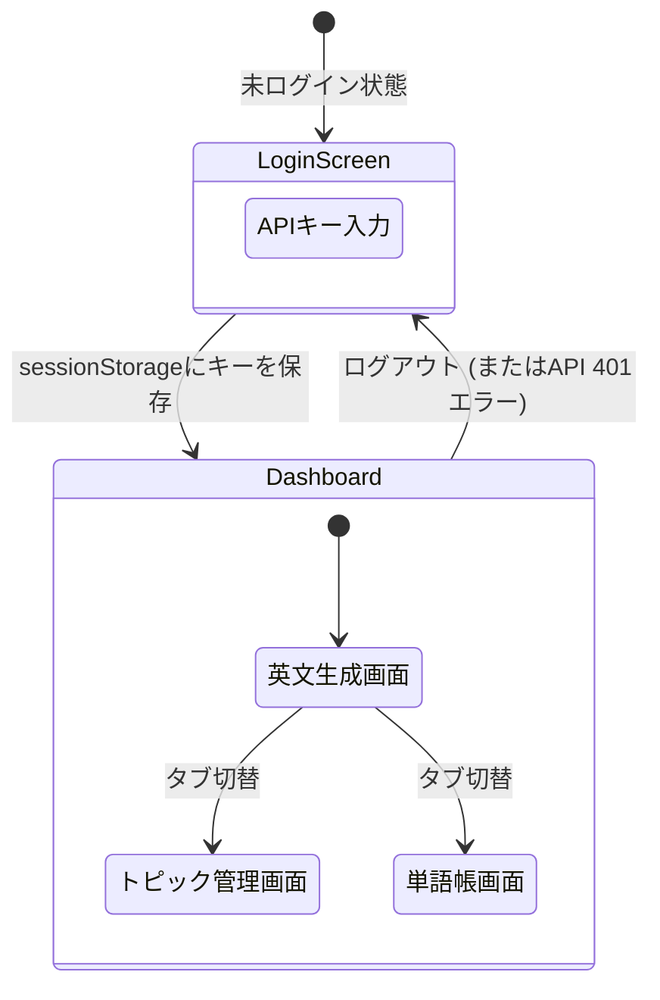

# 3. モダンフロントエンド開発とセキュリティ

## Vite + Reactの実装手法
- **Viteの採用**: 従来のWebpackに比べ、高速なHMRと最適化されたビルドを提供するモダンなビルドツール。
- **コンポーネント指向**: UIとロジックを分離して実装。

### Viteにおける環境変数の扱い
Create React App（`process.env`）とは異なり、Viteでは環境変数に `import.meta.env.VITE_...` を使用する。
バックエンドのAPIエンドポイントなど、環境に依存する設定値は `.env` ファイルで管理し、コード内で安全に参照する。

### 状態(State)管理のサンプル
今回は外部のルーターライブラリを使わず、React標準の `useState` のみでSPA(単一ページ)の画面切り替えやデータ保持を実現している。

```tsx
// 1. 画面の切り替えを管理するステート (App.tsx)
const [activeTab, setActiveTab] = useState('generate');
// activeTab の値が 'generate' なら生成画面、'topics' なら管理画面を表示

// 2. 認証状態を管理するステート (App.tsx)
const [isAuthenticated, setIsAuthenticated] = useState(false);
// false の時は LoginScreen コンポーネントを強制表示

// 3. APIから取得したデータを保持するステート (各コンポーネント)
const [topics, setTopics] = useState<Topic[]>([]);

// 4. ローディング中かどうかを判定するステート
const [loading, setLoading] = useState(false);
// true の時はスピナー(ぐるぐる)を表示
```

### 非同期処理とUX向上策
AI（Gemini）を用いたAPI通信はレスポンスに数秒かかる場合がある。そのため、`loading` ステートを活用して以下のようなUX制御を行っている。
- **多重送信の防止**: API通信中は送信ボタンに `disabled={loading}` を設定し、ユーザーによる二重クリックを防ぐ。
- **視覚的フィードバック**: 通信中であることを示すスピナー（ローディングUI）を表示し、処理が進行中であることを明示する。

## UIデザイン (Vanilla CSS + Glassmorphism)
CSS変数（カスタムプロパティ）やFlexbox/Gridを活用し、素のCSSだけでモダンで保守性の高いデザインを構築。

- **Glassmorphism（グラスモーフィズム）の実装**:
  背景に透ける「すりガラス効果」を取り入れたプレミアムなUI。
  ```css
  .glass-panel {
    background: rgba(255, 255, 255, 0.05); /* 半透明の白背景 */
    backdrop-filter: blur(12px);           /* 背景のぼかし効果 */
    border: 1px solid rgba(255, 255, 255, 0.1);
    border-radius: 16px;
  }
  ```

### レスポンシブ対応の方針
Tailwind CSSなどの外部フレームワークに依存せず、Vanilla CSSの機能（Flexbox / CSS Grid / メディアクエリ）を用いてモバイルフレンドリーな設計としている。
- **モバイルファースト**: 基本的なスタイルはスマートフォン向けに記述し、画面幅が広い場合（例: `@media (min-width: 768px)`）にデスクトップ向けのレイアウト（グリッドの列数変更など）を上書きするアプローチを採用。これにより、シンプルなコードで多様なデバイスに対応している。

## 画面遷移図 (SPAルーティング)


## API連携とエラーハンドリング

API Gatewayとの通信時に発生しやすいCORSエラーやHTTPエラーを、フロントエンド側で適切にキャッチしてUXを損なわないよう実装している。

### fetch通信のエラーハンドリング実装例
```ts
async function fetchApi(endpoint: string) {
  try {
    const res = await fetch(endpoint, {
      headers: { 'x-api-key': sessionStorage.getItem('api_key') || '' }
    });

    // HTTPエラーのハンドリング
    if (!res.ok) {
      if (res.status === 401) {
        sessionStorage.removeItem('api_key'); // 認証切れとして扱う
        window.location.reload();             // ログイン画面へ強制リダイレクト
      }
      throw new Error(`API Error: ${res.status}`);
    }
    return await res.json();
  } catch (error) {
    // CORSエラーやネットワーク切断時のキャッチ
    console.error("Fetch failed:", error);
    alert("サーバーに接続できません。通信環境を確認してください。");
    throw error;
  }
}
```
- **CORS対策**: ネットワークエラーが発生した場合は例外(`catch`)として捕捉し、ユーザーに分かりやすいアラートを表示。
- **401エラー対応**: `sessionStorage` をクリアして画面をリロードし、意図的に未ログイン状態（ログイン画面）へ戻す。

## APIキーのセキュリティ設計

### ランタイム認証とログインスキップ (フロントエンド側)
APIキーをコードに直書き（`.env`含む）するのを避けるため、実行時にユーザーに入力させる方式を採用。

- **基本フロー**:
  1. ログイン画面でユーザーがAPIキーを入力。
  2. ブラウザの `sessionStorage` に保存。
  3. 通信のたびに `x-api-key` ヘッダーへ付与してリクエスト。
- **UX向上（ログインスキップ）**:
  - SPAの利便性を高めるため、リロード時にキーが存在すればログイン画面をスキップする処理（下記コード）を入れている。

```tsx
// ログインスキップの実装例 (App.tsx)
useEffect(() => {
  const savedKey = sessionStorage.getItem('api_key');
  if (savedKey) {
    setIsAuthenticated(true); // キーが存在すれば即座にダッシュボードを表示
  }
}, []);
```

### バックエンド側の工夫 (AWS SSM Parameter Store)
AWS側のAPIキーやGemini APIキーは、コードに直書きせず **SSM Parameter Store** に保存し、Lambdaが実行時に読み込む。

```hcl
# SSMパラメータの作成 (Terraform)
resource "aws_ssm_parameter" "api_key" {
  name  = "/eng-app/api-key"
  type  = "SecureString" # 暗号化して保存
  value = "dummy-value-please-change-in-console"

  # 【重要】Terraformの更新対象から除外する工夫
  lifecycle {
    ignore_changes = [value]
  }
}
```

- **`ignore_changes = [value]` の効果**:
  初期構築時はダミー値でリソースを作成するが、その後AWSコンソール上で手動で「本物のAPIキー」に変更する。この設定を入れることで、次回 `terraform apply` を実行した際にも **TerraformがAWS上の本物のキーをダミー値で上書き（破壊）してしまうのを防ぐ** ことができる。セキュリティとIaCを両立させる必須のテクニック。
