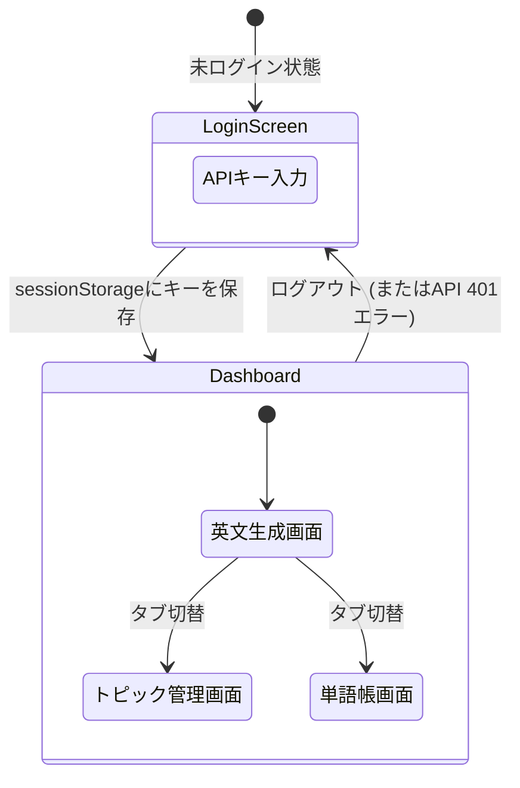

# 3. モダンフロントエンド開発とセキュリティ

## Vite + Reactの実装手法
- **Viteの採用**: 従来のWebpackに比べ、高速なHMRと最適化されたビルドを提供するモダンなビルドツール。
- **コンポーネント指向**: UIとロジックを分離して実装。

### 状態(State)管理のサンプル
今回は外部のルーターライブラリを使わず、React標準の `useState` のみでSPA(単一ページ)の画面切り替えやデータ保持を実現している。

```tsx
// 1. 画面の切り替えを管理するステート (App.tsx)
const [activeTab, setActiveTab] = useState('generate');
// activeTab の値が 'generate' なら生成画面、'topics' なら管理画面を表示

// 2. 認証状態を管理するステート (App.tsx)
const [isAuthenticated, setIsAuthenticated] = useState(false);
// false の時は LoginScreen コンポーネントを強制表示

// 3. APIから取得したデータを保持するステート (各コンポーネント)
const [topics, setTopics] = useState<Topic[]>([]);

// 4. ローディング中かどうかを判定するステート
const [loading, setLoading] = useState(false);
// true の時はスピナー(ぐるぐる)を表示
```

## UIデザイン (Vanilla CSS + Glassmorphism)
CSS変数（カスタムプロパティ）やFlexbox/Gridを活用し、素のCSSだけでモダンで保守性の高いデザインを構築。

- **Glassmorphism（グラスモーフィズム）の実装**:
  背景に透ける「すりガラス効果」を取り入れたプレミアムなUI。
  ```css
  .glass-panel {
    background: rgba(255, 255, 255, 0.05); /* 半透明の白背景 */
    backdrop-filter: blur(12px);           /* 背景のぼかし効果 */
    border: 1px solid rgba(255, 255, 255, 0.1);
    border-radius: 16px;
  }
  ```

## 画面遷移図 (SPAルーティング)


## APIキーのセキュリティ設計

### フロントエンド側の工夫 (ランタイム認証)
APIキーを `.env` に書き込んでソースコードに埋め込むのは脆弱性に繋がる。
そのため、ログイン画面でユーザーに入力させ、ブラウザの `sessionStorage` に保持し、通信のたびに `x-api-key` ヘッダーに付与する方式を採用した。

### バックエンド側の工夫 (AWS SSM Parameter Store)
AWS側のAPIキーやGemini APIキーは、コードに直書きせず **SSM Parameter Store** に保存し、Lambdaが実行時に読み込む。

```hcl
# SSMパラメータの作成 (Terraform)
resource "aws_ssm_parameter" "api_key" {
  name  = "/eng-app/api-key"
  type  = "SecureString" # 暗号化して保存
  value = "dummy-value-please-change-in-console"

  # 【重要】Terraformの更新対象から除外する工夫
  lifecycle {
    ignore_changes = [value]
  }
}
```

- **`ignore_changes = [value]` の効果**:
  初期構築時はダミー値でリソースを作成するが、その後AWSコンソール上で手動で「本物のAPIキー」に変更する。この設定を入れることで、次回 `terraform apply` を実行した際にも **TerraformがAWS上の本物のキーをダミー値で上書き（破壊）してしまうのを防ぐ** ことができる。セキュリティとIaCを両立させる必須のテクニック。
