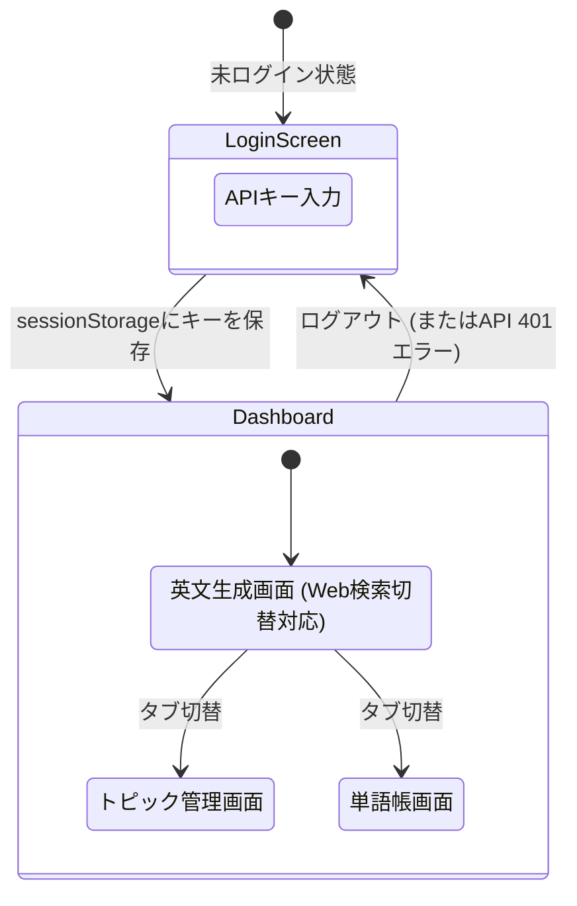

# 4. モダンフロントエンド開発とセキュリティ

## Vite + Reactの実装手法
- **Viteの採用**: 従来のWebpackに比べ、高速なHMRと最適化されたビルドを提供するモダンなビルドツール。
- **コンポーネント指向**: UIとロジックを分離して実装。

### Viteにおける環境変数の扱い
Create React App（`process.env`）とは異なり、Viteでは環境変数に `import.meta.env.VITE_...` を使用する。
バックエンドのAPIエンドポイントなど、環境に依存する設定値は `.env` ファイルで管理し、コード内で安全に参照する。

### 状態(State)管理のサンプル
今回は外部のルーターライブラリを使わず、React標準の `useState` のみでSPA(単一ページ)の画面切り替えやデータ保持を実現している。

```tsx
// 1. 画面の切り替えを管理するステート (App.tsx)
const [activeTab, setActiveTab] = useState('generate');
// activeTab の値が 'generate' なら生成画面、'topics' なら管理画面を表示

// 2. 認証状態を管理するステート (App.tsx)
const [isAuthenticated, setIsAuthenticated] = useState(false);
// false の時は LoginScreen コンポーネントを強制表示

// 3. APIから取得したデータを保持するステート (各コンポーネント)
const [topics, setTopics] = useState<Topic[]>([]);

// 4. 最新ニュース検索(Tavily)のON/OFFステート (TextGenerator.tsx)
const [useWebSearch, setUseWebSearch] = useState<boolean>(false);

// 5. ローディング中かどうかを判定するステート
const [loading, setLoading] = useState(false);
// true の時はスピナー(ぐるぐる)を表示
```

### 非同期処理とUX向上策
AI（Gemini / Tavily）を用いたAPI通信はレスポンスに数秒かかる場合がある。そのため、`loading` ステートを活用して以下のようなUX制御を行っている。
- **多重送信の防止**: API通信中は送信ボタンに `disabled={loading}` を設定し、ユーザーによる二重クリックを防ぐ。
- **視覚的フィードバック**: 通信中であることを示すスピナー（ローディングUI）を表示し、処理が進行中であることを明示する。
- **Web検索失敗時(503)のハンドリング**: Tavily検索でエラーまたは記事0件だった場合、バックエンドが 503 (`Web search failed...`) を返すため、フロントエンドで明示的にエラーメッセージをキャッチして表示し、再試行またはWeb検索OFFでの生成を促す。

## UIデザイン (Vanilla CSS + Glassmorphism)
CSS変数（カスタムプロパティ）やFlexbox/Gridを活用し、素のCSSだけでモダンで保守性の高いデザインを構築。

- **Glassmorphism（グラスモーフィズム）の実装**:
  背景に透ける「すりガラス効果」を取り入れたプレミアムなUI。
  ```css
  .glass-panel {
    background: rgba(255, 255, 255, 0.05); /* 半透明の白背景 */
    backdrop-filter: blur(12px);           /* 背景のぼかし効果 */
    border: 1px solid rgba(255, 255, 255, 0.1);
    border-radius: 16px;
  }
  ```

### レスポンシブ対応の方針
Tailwind CSSなどの外部フレームワークに依存せず、Vanilla CSSの機能（Flexbox / CSS Grid / メディアクエリ）を用いてモバイルフレンドリーな設計としている。
- **モバイルファースト**: 基本的なスタイルはスマートフォン向けに記述し、画面幅が広い場合（例: `@media (min-width: 768px)`）にデスクトップ向けのレイアウト（グリッドの列数変更など）を上書きするアプローチを採用。これにより、シンプルなコードで多様なデバイスに対応している。

## 画面遷移図 (SPAルーティング)


## API連携とエラーハンドリング

API Gatewayとの通信時に発生しやすいCORSエラーやHTTPエラーを、フロントエンド側で適切にキャッチしてUXを損なわないよう実装している。

### fetch通信のエラーハンドリング実装例
```ts
async function fetchApi(endpoint: string) {
  try {
    const res = await fetch(endpoint, {
      headers: { 'x-api-key': sessionStorage.getItem('api_key') || '' }
    });

    // HTTPエラーのハンドリング
    if (!res.ok) {
      if (res.status === 401) {
        sessionStorage.removeItem('api_key'); // 認証切れとして扱う
        window.location.reload();             // ログイン画面へ強制リダイレクト
      }
      throw new Error(`API Error: ${res.status}`);
    }
    return await res.json();
  } catch (error) {
    // CORSエラーやネットワーク切断時のキャッチ
    console.error("Fetch failed:", error);
    alert("サーバーに接続できません。通信環境を確認してください。");
    throw error;
  }
}
```
- **CORS対策**: ネットワークエラーが発生した場合は例外(`catch`)として捕捉し、ユーザーに分かりやすいアラートを表示。
- **401エラー対応**: `sessionStorage` をクリアして画面をリロードし、意図的に未ログイン状態（ログイン画面）へ戻す。

## APIキーのセキュリティ設計

### ランタイム認証とログインスキップ (フロントエンド側)
APIキーをコードに直書き（`.env`含む）するのを避けるため、実行時にユーザーに入力させる方式を採用。

- **基本フロー**:
  1. ログイン画面でユーザーがAPIキーを入力。
  2. ブラウザの `sessionStorage` に保存。
  3. 通信のたびに `x-api-key` ヘッダーへ付与してリクエスト。
- **UX向上（ログインスキップ）**:
  - SPAの利便性を高めるため、リロード時にキーが存在すればログイン画面をスキップする処理（下記コード）を入れている。

```tsx
// ログインスキップの実装例 (App.tsx)
useEffect(() => {
  const savedKey = sessionStorage.getItem('api_key');
  if (savedKey) {
    setIsAuthenticated(true); // キーが存在すれば即座にダッシュボードを表示
  }
}, []);
```

### バックエンド側の工夫 (AWS SSM Parameter Store)
AWS側のAPIキー、Gemini APIキー、Tavily APIキーは、コードに直書きせず **SSM Parameter Store** に保存し、Lambdaが起動時（コールドスタート時）に一括キャッシュ読み込みを行う。

（※初期構築時ダミー値を使用し、コンソールで本物に差し替えるIaCとセキュリティを両立させるTerraformの実装例については `02_terraform_infrastructure.md` のトピック5を参照）

---

## フロントエンドのテスト戦略とモック技術 (Vitest & Playwright)

モダンなReactアプリケーションにおいて、安定したUIとユーザー体験（UX）を保証するには、「単体・コンポーネントテスト」と「実ブラウザによるE2Eテスト」を適切に使い分け、外部依存を的確にモック化することが重要です。

### 1. 2つのテストレイヤーの役割分担

| レイヤー | ツール | 実行環境 | 主な検証スコープ | 実行速度 |
| :--- | :--- | :--- | :--- | :--- |
| **単体・コンポーネントテスト** | **Vitest + RTL** | Node.js (`jsdom`) | 単一コンポーネントの描画、Props/Stateの変化、バリデーション、ローディング表示、ボタンの活性/非活性 | **極めて高速** (全件で数秒) |
| **実ブラウザ E2E テスト** | **Playwright** | 実ブラウザ (Chromium) | 画面を跨ぐユーザー操作フロー、ページリロード時のストレージ永続化、ネイティブダイアログ (`confirm`)、CSS描画 | **中速** (全件で約10秒) |

- **Vitest（コンポーネントテスト）の強み**: ブラウザを立ち上げないためフィードバックが高速。UIの細かな条件分岐（入力不備時のエラー表示やスピナー表示）を網羅するのに最適。
- **Playwright（E2Eテスト）の強み**: `jsdom` ではエミュレートしきれない「本物のブラウザのイベント伝搬」「同期モーダルダイアログ」「CSS Glassmorphism の描画」「Cookie/Storageのライフサイクル」を結合して検証可能。

---

### 2. どこをどうやってモック化するか（モック設計パターン）

外部API（Gemini, Tavily, AWS）との通信やブラウザネイティブの機能をどのようにモック化するか、テストレイヤーごとの手法を整理します。

#### ① Web API通信 (`fetch`) のモック化

* **Vitestの場合 (インメモリのグローバルモック)**:
  `vi.spyOn(globalThis, 'fetch')` を用いて、ブラウザの `fetch` をテストプロセス内で差し替えます。
  ```ts
  // 正常系レスポンスのモック
  vi.spyOn(globalThis, 'fetch').mockResolvedValueOnce(new Response(JSON.stringify(mockData), { status: 200 }));
  
  // 401 Unauthorized や 503 障害のモック
  vi.spyOn(globalThis, 'fetch').mockResolvedValueOnce(new Response('Unauthorized', { status: 401 }));
  ```
  これにより、ネットワーク通信を発生させずに通信前後のコンポーネント状態をミリ秒で検証できます。

* **Playwrightの場合 (ネットワークインターセプト `page.route`)**:
  実ブラウザから発信されるHTTPリクエストをブラウザ層でキャッチし、外部通信を行わせずにモックレスポンスを返します。
  ```ts
  // 正規表現でAPIリクエストを捕捉し、モックレスポンスを返却
  await page.route(/\/generate_text/, async (route) => {
    return route.fulfill({
      status: 200,
      contentType: 'application/json',
      body: JSON.stringify(mockAnalyzeResult),
    });
  });
  ```
  **この設計の利点**:
  - 実ブラウザテストでありながら、**バックエンドサーバーの事前起動が一切不要**（Vite開発サーバーのみで完結）。
  - Gemini / Tavily / AWS への通信が1ミリも発生しないため、**トークン消費ゼロ・API課金ゼロ**を100%保証。

#### ② ブラウザ固有ストレージ (`sessionStorage`) のモックと検証

APIキーや認証状態の保持をテストする場合、テストケースごとにストレージの初期状態を注入します。
- **Vitest**: `sessionStorage.setItem('api_key', 'test-key')` を `beforeEach` でセット。401エラー発生時に `sessionStorage.removeItem` が実行されるかをアサート。
- **Playwright**: ログインフォームへの入力・送信を通じてストレージに保存させ、`page.reload()` 実行後もログイン状態が維持されているかを実ブラウザ上で検証。

#### ③ ネイティブダイアログ (`window.confirm` / `alert`) のハンドリング

要素削除時の「本当に削除しますか？」などの確認ダイアログは、JavaScriptの実行スレッドを同期的（モーダル）にブロックします。
- **Vitest**: `window.confirm = vi.fn().mockReturnValue(true)` で真偽値を即座に返すようモック。
- **Playwright**:
  - 同期ダイアログ（クリックと同時に発火）: `page.once('dialog', dialog => dialog.accept())` をクリック前に登録して自動承認。
  - 非同期API完了後のダイアログ（保存完了の `alert` 等）: `const dialogPromise = page.waitForEvent('dialog')` で待機し、メッセージ内容をアサート。

---

### 3. 非同期UIと待機戦略 (Async Testing)

API通信を伴うUIテストでは、「クリックした瞬間にすぐアサートする」とテストが失敗します。
- **要素の出現待ち**: `getByText`（即座に同期取得）ではなく、`findByText` や `expect(locator).toBeVisible()`（ポーリング待機）を使用することで、非同期通信後のDOM描画をフレイキー（不安定）にならずに検証。
- **多重送信防止の検証**: 送信ボタン押下直後に `disabled` 属性が付与され、通信完了後に解除されるかをテスト。

---

### 4. 視覚的テスト・デバッグ技術 (Playwright)

Playwright では、ヘッドレスでのCI実行だけでなく、開発者が画面を見ながら直感的にデバッグできるモードが用意されています。

- **インタラクティブ UI モード (`--ui`)**:
  GUIダッシュボードが立ち上がり、操作ステップごとのタイムトラベル（DOM・通信スナップショットの再現）やテストの個別再生が可能。
- **Headed モード (`--headed`)**:
  実際の Chromium ウィンドウが開き、自動入力・クリックの様子を肉眼で確認。`--workers=1` を指定することで1つずつじっくり観察可能。
- **ステップ実行デバッグ (`--debug`)**:
  Playwright Inspector が起動し、1行ずつ「Step Over」しながら要素のセレクターや挙動を検証。
