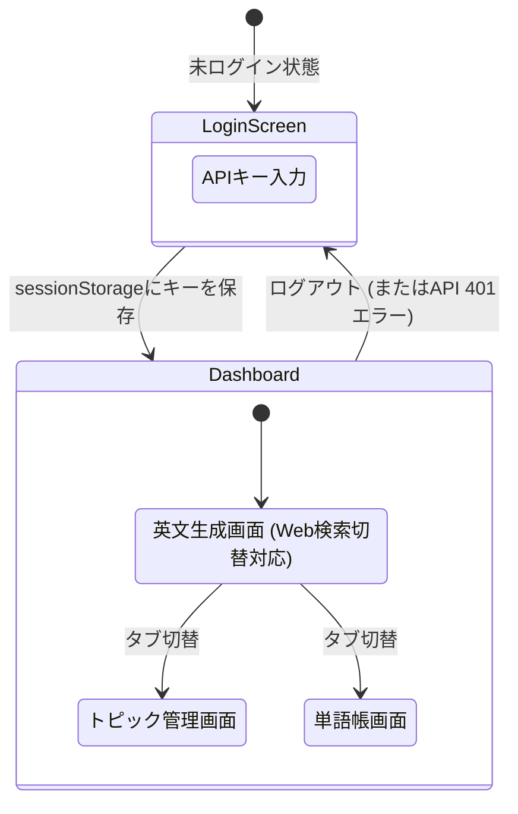

# 4. モダンフロントエンド開発とセキュリティ

## Vite + Reactの実装手法
- **Viteの採用**: 従来のWebpackに比べ、高速なHMRと最適化されたビルドを提供するモダンなビルドツール。
- **コンポーネント指向**: UIとロジックを分離して実装。

### Viteにおける環境変数の扱い
Create React App（`process.env`）とは異なり、Viteでは環境変数に `import.meta.env.VITE_...` を使用する。
バックエンドのAPIエンドポイントなど、環境に依存する設定値は `.env` ファイルで管理し、コード内で安全に参照する。

### 状態(State)管理のサンプル
今回は外部のルーターライブラリを使わず、React標準の `useState` のみでSPA(単一ページ)の画面切り替えやデータ保持を実現している。

```tsx
// 1. 画面の切り替えを管理するステート (App.tsx)
const [activeTab, setActiveTab] = useState('generate');
// activeTab の値が 'generate' なら生成画面、'topics' なら管理画面を表示

// 2. 認証状態を管理するステート (App.tsx)
const [isAuthenticated, setIsAuthenticated] = useState(false);
// false の時は LoginScreen コンポーネントを強制表示

// 3. APIから取得したデータを保持するステート (各コンポーネント)
const [topics, setTopics] = useState<Topic[]>([]);

// 4. 最新ニュース検索(Tavily)のON/OFFステート (TextGenerator.tsx)
const [useWebSearch, setUseWebSearch] = useState<boolean>(false);

// 5. ローディング中かどうかを判定するステート
const [loading, setLoading] = useState(false);
// true の時はスピナー(ぐるぐる)を表示
```

### 非同期処理とUX向上策
AI（Gemini / Tavily）を用いたAPI通信はレスポンスに数秒かかる場合がある。そのため、`loading` ステートを活用して以下のようなUX制御を行っている。
- **多重送信の防止**: API通信中は送信ボタンに `disabled={loading}` を設定し、ユーザーによる二重クリックを防ぐ。
- **視覚的フィードバック**: 通信中であることを示すスピナー（ローディングUI）を表示し、処理が進行中であることを明示する。
- **Web検索失敗時(503)のハンドリング**: Tavily検索でエラーまたは記事0件だった場合、バックエンドが 503 (`Web search failed...`) を返すため、フロントエンドで明示的にエラーメッセージをキャッチして表示し、再試行またはWeb検索OFFでの生成を促す。

## UIデザイン (Vanilla CSS + Glassmorphism)
CSS変数（カスタムプロパティ）やFlexbox/Gridを活用し、素のCSSだけでモダンで保守性の高いデザインを構築。

- **Glassmorphism（グラスモーフィズム）の実装**:
  背景に透ける「すりガラス効果」を取り入れたプレミアムなUI。
  ```css
  .glass-panel {
    background: rgba(255, 255, 255, 0.05); /* 半透明の白背景 */
    backdrop-filter: blur(12px);           /* 背景のぼかし効果 */
    border: 1px solid rgba(255, 255, 255, 0.1);
    border-radius: 16px;
  }
  ```

### レスポンシブ対応の方針
Tailwind CSSなどの外部フレームワークに依存せず、Vanilla CSSの機能（Flexbox / CSS Grid / メディアクエリ）を用いてモバイルフレンドリーな設計としている。
- **モバイルファースト**: 基本的なスタイルはスマートフォン向けに記述し、画面幅が広い場合（例: `@media (min-width: 768px)`）にデスクトップ向けのレイアウト（グリッドの列数変更など）を上書きするアプローチを採用。これにより、シンプルなコードで多様なデバイスに対応している。

## 画面遷移図 (SPAルーティング)


## API連携とエラーハンドリング

API Gatewayとの通信時に発生しやすいCORSエラーやHTTPエラーを、フロントエンド側で適切にキャッチしてUXを損なわないよう実装している。

### fetch通信のエラーハンドリング実装例
```ts
async function fetchApi(endpoint: string) {
  try {
    const res = await fetch(endpoint, {
      headers: { 'x-api-key': sessionStorage.getItem('api_key') || '' }
    });

    // HTTPエラーのハンドリング
    if (!res.ok) {
      if (res.status === 401) {
        sessionStorage.removeItem('api_key'); // 認証切れとして扱う
        window.location.reload();             // ログイン画面へ強制リダイレクト
      }
      throw new Error(`API Error: ${res.status}`);
    }
    return await res.json();
  } catch (error) {
    // CORSエラーやネットワーク切断時のキャッチ
    console.error("Fetch failed:", error);
    alert("サーバーに接続できません。通信環境を確認してください。");
    throw error;
  }
}
```
- **CORS対策**: ネットワークエラーが発生した場合は例外(`catch`)として捕捉し、ユーザーに分かりやすいアラートを表示。
- **401エラー対応**: `sessionStorage` をクリアして画面をリロードし、意図的に未ログイン状態（ログイン画面）へ戻す。

## APIキーのセキュリティ設計

### ランタイム認証とログインスキップ (フロントエンド側)
APIキーをコードに直書き（`.env`含む）するのを避けるため、実行時にユーザーに入力させる方式を採用。

- **基本フロー**:
  1. ログイン画面でユーザーがAPIキーを入力。
  2. ブラウザの `sessionStorage` に保存。
  3. 通信のたびに `x-api-key` ヘッダーへ付与してリクエスト。
- **UX向上（ログインスキップ）**:
  - SPAの利便性を高めるため、リロード時にキーが存在すればログイン画面をスキップする処理（下記コード）を入れている。

```tsx
// ログインスキップの実装例 (App.tsx)
useEffect(() => {
  const savedKey = sessionStorage.getItem('api_key');
  if (savedKey) {
    setIsAuthenticated(true); // キーが存在すれば即座にダッシュボードを表示
  }
}, []);
```

### バックエンド側の工夫 (AWS SSM Parameter Store)
AWS側のAPIキー、Gemini APIキー、Tavily APIキーは、コードに直書きせず **SSM Parameter Store** に保存し、Lambdaが起動時（コールドスタート時）に一括キャッシュ読み込みを行う。

（※初期構築時ダミー値を使用し、コンソールで本物に差し替えるIaCとセキュリティを両立させるTerraformの実装例については `02_terraform_infrastructure.md` のトピック5を参照）

---

## フロントエンドの自動テスト戦略 (Vitest + React Testing Library)

SPAにおけるUI状態管理とAPI連携の堅牢性を保証するため、ブラウザを起動せず `jsdom` 上で数秒で完結する自動テスト基盤を構築。

### 1. テスト構成と検証スコープ (全40件)
- **`src/api.test.ts` (14件)**:
  `fetch` をモック化し、`sessionStorage` 認証ヘッダーの付与、401時の自動セッション破棄・リロード、各API（Topics, Vocabulary, Generate, Analyze）のPayload構造を単体検証。
- **`src/components/Login.test.tsx` (5件)**:
  キー入力バリデーション、検証中ローディング状態、不一致時エラーメッセージ表示、ログイン成功時のコールバック。
- **`src/components/TopicManager.test.tsx` (6件)**:
  一覧描画、新規追加（空文字ガード）、確認ダイアログ付き削除。
- **`src/components/VocabularyManager.test.tsx` (5件)**:
  単語帳一覧描画、単語＋和訳の入力・登録、削除フロー。
- **`src/components/TextGenerator.test.tsx` (5件)**:
  Web検索ON/OFFチェックボックス、生成中スピナー表示、生成結果描画、Slash Reading タブクリックでの構文解析自動実行、アコーディオン開閉（和訳・文法解説表示）、単語帳への保存。
- **`src/App.test.tsx` (5件)**:
  認証状態による表示切り替え（Login ⇔ Dashboard）、サイドバーのタブ遷移、ログアウトフロー。

### 2. テストの実行方法
```bash
# フロントエンドテスト単体実行 (約5秒)
mise run test:front

# フロントエンド開発時の自動再実行 (ウォッチモード)
cd frontend && npm run test:watch
```
