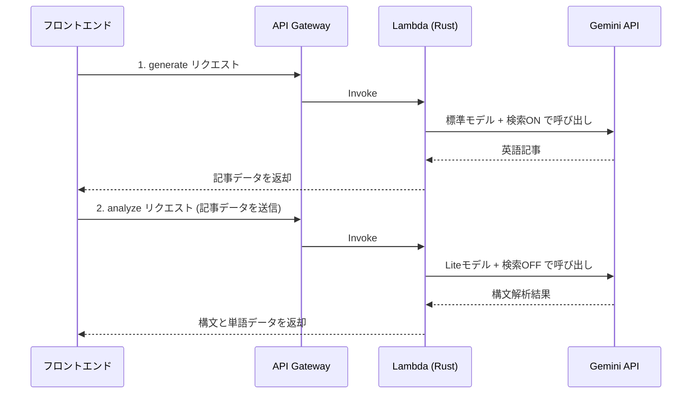

# 5. AI (Gemini API) 連携とコスト最適化

本プロジェクトでは、Googleの `Gemini API (gemini-1.5-flash)` を用いて英語学習コンテンツ（英文生成・和訳・構文解説など）の生成を行っている。

## Gemini APIの利用準備
1. **APIキーの取得**: Google AI StudioからGemini APIのキーを発行し、AWS SSM Parameter Storeに保存する。
2. **エンドポイント**: REST APIとして以下のURLに対してHTTP POSTリクエストを送信する。
   `https://generativelanguage.googleapis.com/v1beta/models/gemini-1.5-flash:generateContent?key=<API_KEY>`

## バックエンド(Rust)からの組み込み方法
AWS Lambda (Rust) からGemini APIを呼び出す具体的な実装手順（HTTPクライアントには `reqwest` クレートを使用）。

### ハイブリッド方式（2ステップ処理）
コストと精度のバランスを最適化するため、APIへのリクエストを2つのアクションに分割し、用途に応じてモデルを使い分けている。

| アクション | 使用モデル | Google Search | 目的・用途 |
| :--- | :--- | :---: | :--- |
| `generate` | **標準モデル** (`1.5-flash`) | **ON** | 高品質な最新情報の取得と、長文の英語記事生成 |
| `analyze`  | **Liteモデル** (`1.5-flash-lite`) | OFF | 生成済み記事の構文解析、キーワード抽出（単純なテキスト処理） |

### データ処理フロー


- **実装イメージ**:
  ```rust
  // reqwestクライアントの生成
  let client = reqwest::Client::new();
  
  // Gemini APIへのリクエストボディ作成
  let request_body = json!({
      "system_instruction": {
          "parts": [{ "text": "あなたはプロの英語教師です。必ず指定されたJSONスキーマで返答してください。" }]
      },
      "contents": [{
          "parts": [{ "text": format!("トピック: {} について英語の長文を作ってください。", topic) }]
      }],
      "generationConfig": {
          "response_mime_type": "application/json"
      }
  });

  // APIリクエストの送信
  let res = client.post(api_url)
      .json(&request_body)
      .send()
      .await?;
      
  // レスポンスのJSONをパースして構造体にマッピング
  let response_data: GeminiResponse = res.json().await?;
  ```

- **データの流れ**: 
  API Gateway経由でフロントエンドからアクション種別（generate/analyze）とトピック名等を受け取り、Rust内でGemini APIを呼び出す。得られたJSON結果をフロントエンドに返却し、画面に表示させる。
