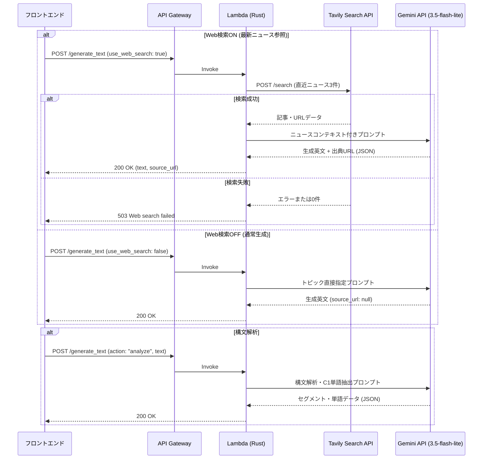

# 5. AI (Gemini API) & Web検索 (Tavily) 連携とコスト最適化

本プロジェクトでは、検索特化エンジン **Tavily AI Search API** と Google の生成AI **Gemini API (`gemini-3.5-flash-lite`)** を連携させ、高速・高精度かつ完全月額0円での英語学習コンテンツ生成を実現しています。

## 1. アーキテクチャの変遷: 検索と生成の責務分離 (Decoupled Search & LLM)

当初はGemini API組み込みのGoogle Searchツール（`googleSearch`）を検討しましたが、無料枠におけるAPI制限や原因不明の500/503エラーが多発しました。
そこで、**「検索」と「要約・英文生成」の責務を明確に分離**するアーキテクチャに刷新しました。

| 責務 | 採用技術 | 選定理由・特徴 |
| :--- | :--- | :--- |
| **Web検索** | **Tavily AI Search API** | ・LLM/RAG向けに設計されたAI特化型検索エンジン<br>・直近3日間のニュース記事本文とURLをクリーンなJSONで取得可能<br>・月間1,000回まで完全無料で利用可能 |
| **生成・解析** | **Gemini 3.5 Flash-lite** | ・Googleの最新超軽量・超高速モデル<br>・無料枠が大きくレイテンシが極めて低い<br>・150〜250語の英文生成や構文・語彙解析に十分な表現力を持つ |

---

## 2. データ処理フロー

ユーザーが「最新ニュースを参照する」をONにした場合とOFFにした場合で、Lambda内部の処理が分岐します。



---

## 3. 実装詳細

### 3.1 Tavily AI Search API の呼び出し (`call_tavily_search`)
`reqwest` クライアントを用い、トピックに関連する直近のニュースを検索します。
万一検索が失敗した場合、勝手に古い知識でフォールバックしてユーザーを混乱させないよう、**即座にエラー（503）を返すフェイルファスト設計**にしています。

```rust
let request_body = json!({
    "query": format!("{} latest news", query),
    "topic": "news",
    "days": 3,
    "max_results": 3,
    "include_answer": false
});

let res = http_client
    .post("https://api.tavily.com/search")
    .header("Authorization", format!("Bearer {}", tavily_api_key))
    .json(&request_body)
    .send()
    .await;
```

### 3.2 プロンプト設計と語数最適化 (150〜250語)
英語速読・構文把握の学習効果を最大化しつつAPIレイテンシを短縮するため、生成する英文記事の語数を **150〜250語** に厳格に制限しています。

- **対象レベル**: TOEIC 800+ / CEFR B2-C1 向けの実践的な上級ビジネス英語
- **構造化出力の担保**:
  - Gemini APIの `generationConfig: { "responseMimeType": "application/json" }` を指定。
  - LLMが万一Markdown記法（` ```json ... ``` `）を出力した場合に備え、Rust側で最初の `{` から最後の `}` までを部分文字列抽出する堅牢なパースロジックを実装。

### 3.3 構文解析（スラッシュリーディング）とC1単語抽出
`action: "analyze"` の際は、以下のルールでJSONデータを生成します。
- **セグメント分割**: 意味の塊（チャンク）ごとに分割し、和訳と文法役割（S/V/O/前置詞句など）を付与。
- **語彙抽出**: 学習者が既に知っている基礎〜中級単語（A1〜B2）はスキップし、ビジネスで役立つ上級語彙（CEFR C1レベル）のみを最大10単語抽出。

---

## 4. コストと無料枠の維持

- **Gemini API (`gemini-3.5-flash-lite`)**: 無料枠内で1日あたり十分な回数のリクエストをカバー。
- **Tavily AI Search API**: 開発者向け無料枠で月1,000回の検索が可能（個人学習用としては十分）。
- **ダミーモード**: ローカル開発時やテスト時は環境変数 `USE_MOCK_AI=true` またはトピック名 `test` でAPI呼び出しをバイパスし、無駄なトークン消費を完全に防止。
