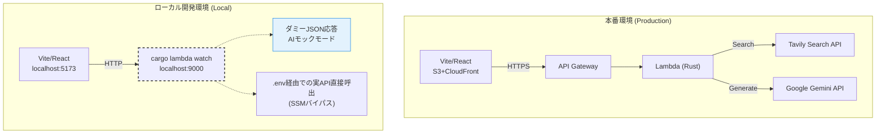

# 6. サーバーレス＆AIアプリのローカル開発手法

クラウドやAIに依存するアプリ開発における「デプロイの手間」「API課金・制限」を解決し、**クラウド課金ゼロ・API制限ゼロ**でフロントエンドを高速開発するための仕組み。

## 環境構成の比較（本番 vs ローカル）



## 1. `cargo lambda watch` によるバックエンドのローカル起動
毎回AWSにZIPデプロイする手間を省き、ローカルマシン上に擬似的なLambda環境（ポート9000）を立ち上げる。

```bash
$ cargo lambda watch --env-file .env
```
- フロントエンドの通信先を `http://localhost:9000/...` に向けるだけで、本番同等のテストが可能。

## 2. AIダミーモード（モック）の仕組み
UI微調整のたびに本物のGemini / Tavily APIを叩くと利用上限（レートリミット）に到達してしまうため、バックエンド側で通信をバイパスする仕組み。

### ダミーモードの発動条件
以下のいずれかを満たした場合、外部API通信をスキップして**固定のダミーJSON**を即座に返す。
1. **マジックワード**: 入力トピック名が `test` や `dummy` で始まる。
2. **APIキー未設定**: Gemini APIキーが未設定（空文字、または初期値 `CHANGE_ME_GEMINI_KEY`）。

```rust
// ダミー判定ロジック (backend/src/bin/generate_text.rs)
let is_dummy_mode = topic_name.to_lowercase().starts_with("test")
    || topic_name.to_lowercase().starts_with("dummy")
    || gemini_api_key.is_empty()
    || gemini_api_key.as_str() == "CHANGE_ME_GEMINI_KEY";

if is_dummy_mode {
    // 外部APIを叩かず、数ミリ秒で固定データ(Mock JSON)を返す
    return Ok(Response::builder().body(mock_json));
}
```

- **DX (開発体験) の向上**: APIの制限枠や「数秒のAI応答待ち」を気にすることなく、ローカルで**瞬時に**UI・状態遷移のテストを反復できる。

## 3. ローカルでの実API連携テスト (SSMバイパス)
本物のAI応答やTavily検索の精度をローカルで確かめたい場合、AWS SSMにアクセスする必要なく、`backend/.env` に直接キーを定義するだけで動作する仕組み（優先度: 環境変数 > AWS SSM）を設けている。

```rust
// backend/src/lib.rs
pub async fn get_gemini_api_key(ssm_client: &SsmClient) -> String {
    // 1. 環境変数 (ローカル開発用) を優先
    if let Ok(val) = std::env::var("GEMINI_API_KEY") {
        return val;
    }
    // 2. なければ AWS SSM Parameter Store から取得
    ...
}
```
これにより、AWSの認証情報を意識せず、ローカル完結で実APIの疎通・プロンプト検証を安全に行うことができる。

---

## 4. 自動テストとコードカバレッジ (Mise + wiremock + Vitest)

開発者が日常的に素早く品質検証を行えるよう、タスクランナー `mise` を起点とした自動テスト基盤を整備している。

```bash
# 全体テスト (バックエンド カバレッジ + フロントエンド テスト: 計63件)
mise run test:all

# 個別実行
mise run test:back    # Rust 単体・HTTPモックテスト (約8秒)
mise run test:front   # Vitest フロントエンドコンポーネントテスト (約5秒)
```

### バックエンドのコードカバレッジ (`cargo-llvm-cov`)
LLVMのソースコードインストルメンテーションを活用し、行単位・関数単位の網羅率を正確に計測。
実行時にターミナル出力と同時にHTMLレポートが `backend/target/llvm-cov/html/index.html` に自動生成され、ブラウザで未カバー行をカラー確認できる。

### フロントエンドの高速コンポーネントテスト (`Vitest`)
Viteと設定を共有し、ブラウザを起動せずメモリ上の `jsdom` で React 19 コンポーネントを検証。UIの表示、入力、タブ遷移、ローディングスピナー、エラー表示などを約5秒で全件自動テストできる。

