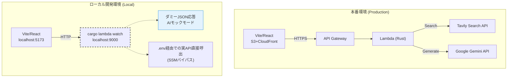
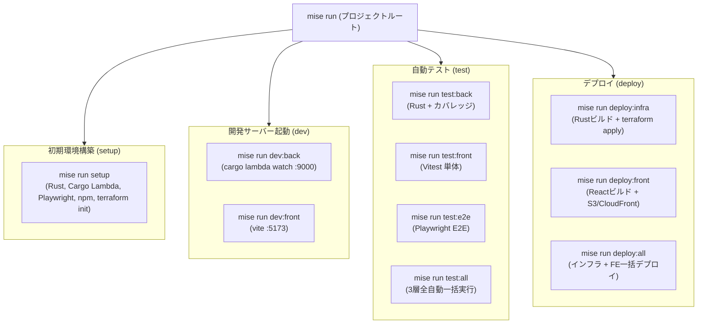

# 6. サーバーレス＆AIアプリのローカル開発手法

クラウドやAIに依存するアプリ開発における「デプロイの手間」「API課金・制限」を解決し、**クラウド課金ゼロ・API制限ゼロ**でフロントエンドを高速開発するための仕組み。

## 環境構成の比較（本番 vs ローカル）



## 1. `cargo lambda watch` によるバックエンドのローカル起動
毎回AWSにZIPデプロイする手間を省き、ローカルマシン上に擬似的なLambda環境（ポート9000）を立ち上げる。

```bash
$ cargo lambda watch --env-file .env
```
- フロントエンドの通信先を `http://localhost:9000/...` に向けるだけで、本番同等のテストが可能。

## 2. AIダミーモード（モック）の仕組み
UI微調整のたびに本物のGemini / Tavily APIを叩くと利用上限（レートリミット）に到達してしまうため、バックエンド側で通信をバイパスする仕組み。

### ダミーモードの発動条件
以下のいずれかを満たした場合、外部API通信をスキップして**固定のダミーJSON**を即座に返す。
1. **マジックワード**: 入力トピック名が `test` や `dummy` で始まる。
2. **APIキー未設定**: Gemini APIキーが未設定（空文字、または初期値 `CHANGE_ME_GEMINI_KEY`）。

```rust
// ダミー判定ロジック (backend/src/bin/generate_text.rs)
let is_dummy_mode = topic_name.to_lowercase().starts_with("test")
    || topic_name.to_lowercase().starts_with("dummy")
    || gemini_api_key.is_empty()
    || gemini_api_key.as_str() == "CHANGE_ME_GEMINI_KEY";

if is_dummy_mode {
    // 外部APIを叩かず、数ミリ秒で固定データ(Mock JSON)を返す
    return Ok(Response::builder().body(mock_json));
}
```

- **DX (開発体験) の向上**: APIの制限枠や「数秒のAI応答待ち」を気にすることなく、ローカルで**瞬時に**UI・状態遷移のテストを反復できる。

## 3. ローカルでの実API連携テスト (SSMバイパス)
本物のAI応答やTavily検索の精度をローカルで確かめたい場合、AWS SSMにアクセスする必要なく、`backend/.env` に直接キーを定義するだけで動作する仕組み（優先度: 環境変数 > AWS SSM）を設けている。

```rust
// backend/src/lib.rs
pub async fn get_gemini_api_key(ssm_client: &SsmClient) -> String {
    // 1. 環境変数 (ローカル開発用) を優先
    if let Ok(val) = std::env::var("GEMINI_API_KEY") {
        return val;
    }
    // 2. なければ AWS SSM Parameter Store から取得
    ...
}
```
これにより、AWSの認証情報を意識せず、ローカル完結で実APIの疎通・プロンプト検証を安全に行うことができる。

---

## 4. 自動テストとコードカバレッジ (Mise + wiremock + Vitest + Playwright)

開発者が日常的に素早く品質検証を行えるよう、タスクランナー `mise` を起点とした3層の自動テスト基盤を整備している。
どのレイヤーも外部通信を遮断（モック化）しているため、APIキー不要・トークン消費ゼロで安全かつ高速に実行できる。

```bash
# 全体テスト一括実行 (計69件 PASS: バックエンド23件 + 単体40件 + E2E 6件)
mise run test:all

# 個別実行
mise run test:back    # Rust 単体・HTTPモックテスト (約8秒, カバレッジ計測付き)
mise run test:front   # Vitest フロントエンドコンポーネントテスト (約5秒)
mise run test:e2e     # Playwright 実ブラウザE2Eテスト (約10秒)
```

### バックエンドのコードカバレッジ (`cargo-llvm-cov`)
LLVMのソースコードインストルメンテーションを活用し、行単位・関数単位の網羅率を正確に計測。
実行時にターミナル出力と同時にHTMLレポートが `backend/target/llvm-cov/html/index.html` に自動生成され、ブラウザで未カバー行をカラー確認できる。

### フロントエンドの高速コンポーネントテスト (`Vitest`)
Viteと設定を共有し、ブラウザを起動せずメモリ上の `jsdom` で React 19 コンポーネントを検証。UIの表示、入力、タブ遷移、ローディングスピナー、エラー表示などを約5秒で全40件自動テストできる。

### 実ブラウザ E2E 自動テスト (`Playwright`)
実ブラウザ（Chromium）を起動し、ログイン、記事生成、構文解析アコーディオン、単語帳保存ダイアログ、CRUDの一連の操作フローを検証。
Playwright のネットワークインターセプト（`page.route`）により外部API通信を遮断し、トークン消費ゼロを保証。

> **画面を見ながらのテスト・デバッグ:**
> - `mise run test:e2e --ui`: タイムトラベル可能な公式GUIダッシュボードを起動（推奨）。
> - `mise run test:e2e --headed`: 実際のブラウザウィンドウを開いて自動操作を観察。
> - `mise run test:e2e --debug`: 1行ずつステップ実行しながらデバッグ。

---

## 5. ワンコマンド環境構築 (`mise run setup`) によるセットアップの自動化

開発者が本リポジトリに参画する際の初期環境構築（オンボーディング）の手間を最小化するため、すべてのセットアップ処理を `mise run setup` に集約。

### 自動化されている処理内容
1. **Rust ツールチェーン**: 未インストールの場合は `rustup` および stable ツールチェーンを自動導入。
2. **Cargo Lambda**: Lambda 関数のビルド・エミュレーションツール（`cargo-lambda`）を自動導入。
3. **バックエンドテストツール**: `cargo-llvm-cov` および `llvm-tools-preview` を導入。
4. **フロントエンド依存関係**: `npm install` により全Nodeパッケージを導入。
5. **Playwright ヘッドレスブラウザ**: Chromium バイナリおよび Linux 共有ライブラリ（`libnspr4`, `libnss3`, `libasound2`）を自動配置。
6. **Terraform**: `terraform init` によるプロバイダー初期化。

---

## 6. すべての開発ライフサイクルを `mise` タスクへ集約 (Unified Developer Experience)

### なぜ `mise` タスクに集約したのか（背景と課題）
本プロジェクトのようなフルスタック＆サーバーレス環境では、使用する言語やツール、作業ディレクトリが多岐にわたります：
- **バックエンド**: Rust, Cargo, `cargo-lambda`, `cargo-llvm-cov` (`backend/`)
- **フロントエンド**: Node.js, npm, Vite, Vitest, Playwright (`frontend/`)
- **インフラ (IaC)**: Terraform, AWS CLI (`backend/infra/`)

従来の開発スタイルでは、以下のように開発者がディレクトリを行き来し、ツールごとの固有コマンドを暗記して実行する必要がありました：
- バックエンド起動: `cd backend && cargo lambda watch --env-file .env`
- フロントエンド起動: `cd frontend && npm run dev`
- インフラ反映: `cd backend/infra && terraform apply`
- フロントエンドデプロイ: `cd frontend && npm run build && aws s3 sync ...`
- 各種テスト: `cargo test`, `npm test`, `npx playwright test`

これにより、「どのディレクトリで実行すべきか」「オプションや引数は何だったか」という認知負荷が生じ、ツールのバージョン違いや PATH の不通によるトラブルが多発しがちでした。

### Mise タスクによる階層的統合アーキテクチャ
プロジェクトルート直下の `.mise/tasks/` 配下にディレクトリ構造でタスクを整理し、**「すべての開発・テスト・デプロイ操作がプロジェクトルートから `mise run <category>:<target>` で完結する」** 仕組みを構築しました。



| カテゴリ | タスク名 | 実行内容 |
| :--- | :--- | :--- |
| **環境構築** | `mise run setup` | Rust, Cargo Lambda, Playwright, フロント依存, Terraform の全自動導入・初期化 |
| **ローカル開発** | `mise run dev:back` | ポート9000での Lambda エミュレータ起動 (`cargo lambda watch`) |
| | `mise run dev:front` | ポート5173での Vite 開発サーバー起動 |
| **自動テスト** | `mise run test:back` | バックエンド単体・HTTPモックテスト ＋ カバレッジ計測 (HTML/端末) |
| | `mise run test:front` | フロントエンド単体・コンポーネントテスト (Vitest) |
| | `mise run test:e2e` | フロントエンド実ブラウザ E2E テスト (Playwright) |
| | `mise run test:all` | 上記 3 レイヤーの全テスト（計69件）の一括実行 |
| **本番デプロイ** | `mise run deploy:infra` | Rust Lambda のクロスコンパイル ＋ Terraform による AWS インフラ適用 |
| | `mise run deploy:front` | React アプリのプロダクションビルド ＋ S3 アップロード ＋ CloudFront キャッシュ無効化 |
| | `mise run deploy:all` | インフラとフロントエンドの一括本番デプロイ |

### 集約によって得られたメリット
1. **認知負荷の劇的な削減**:
   開発者は `mise run` を叩くだけで利用可能なタスク一覧を確認でき、個別ツールの CLI 仕様やディレクトリ移動を一切意識する必要がなくなった。
2. **環境依存・PATH 問題の解消**:
   `mise.toml` で定義された環境変数（`PATH` への `~/.local/bin`, `~/.cargo/bin` 追加、`LD_LIBRARY_PATH`）が全タスクに透過的に引き継がれるため、シェルの設定差分による「手元では動かない」問題を根絶。
3. **CI/CD との完全な共通化**:
   ローカルで叩いている `mise run test:all` や `mise run deploy:all` を GitHub Actions などの CI/CD でも全く同じコマンドとして利用でき、環境差分によるデプロイ失敗を防止できる。

