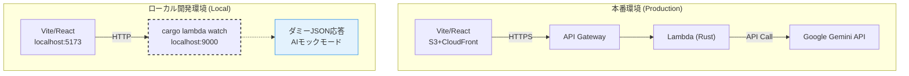

# 6. サーバーレス＆AIアプリのローカル開発手法

クラウドやAIに依存するアプリ開発における「デプロイの手間」「API課金・制限」を解決し、**クラウド課金ゼロ・API制限ゼロ**でフロントエンドを高速開発するための仕組み。

## 環境構成の比較（本番 vs ローカル）



## 1. `cargo lambda watch` によるバックエンドのモック起動
毎回AWSにZIPデプロイする手間を省き、ローカルマシン上に擬似的なLambda環境（ポート9000）を立ち上げる。

```bash
$ cargo lambda watch --env-file .env
```
- フロントエンドの通信先を `http://localhost:9000/...` に変更するだけで、本番同等のテストが可能。

## 2. AIダミーモード（モック）の仕組み
UI微調整のたびに本物のGemini APIを叩くと利用上限（レートリミット）に到達してしまうため、バックエンド側で通信をバイパスする仕組み。

### ダミーモードの発動条件
以下のいずれかを満たした場合、AI通信をスキップして**固定のダミーJSON**を即座に返す。
1. **環境変数**: `.env` に `USE_MOCK_AI=true` がある。
2. **マジックワード**: 入力トピック名が `test` や `dummy` で始まる。
3. **APIキー未設定**: AWS SSMのキーが初期値（`DUMMY_KEY_FOR_TESTING`）のまま。

```rust
// ダミー判定ロジック (Rust)
let is_dummy_mode = std::env::var("USE_MOCK_AI").is_ok() 
    || topic_name.to_lowercase().starts_with("test")
    || topic_name.to_lowercase().starts_with("dummy")
    || api_key == "DUMMY_KEY_FOR_TESTING";

if is_dummy_mode {
    // 外部APIを叩かず、数ミリ秒で固定データ(Mock JSON)を返す
    return Ok(Response::builder().body(mock_json));
}
```

- **DX (開発体験) の向上**: APIの制限枠や「数秒のAI応答待ち」を気にすることなく、ローカルで**瞬時に**UI・状態遷移のテストを反復できる。
